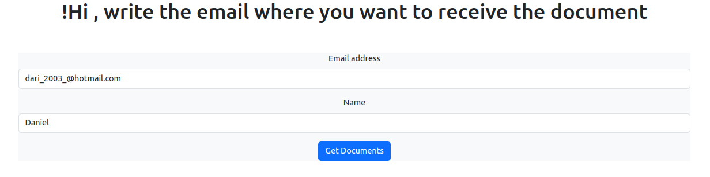
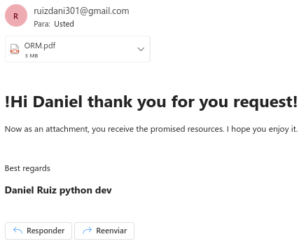

# Send emails

This project shows a basic form where an email and name are requested, then the person providing this information is sent an email with a thank you message and an attached pdf which is a book on the django ORM.

## Files included

| File                                           | Details                                           |
| ---------------------------------------------- | ------------------------------------------------- |
| [emails/send_email.py](emails/send_email.py)   | contain the code to send email and the attachment |
| [resources](resources)                         | contain the pdf that is sent as an attachment     |
| [templates/bye.html](templates/bye.html)       | contains the contains the goodbye html            |
| [templates/form.html](templates/form.html)     | contains the html form                            |
| [templates/thanks.html](templates/thanks.html) | contains the body of the email                    |

example:

## Authors

Daniel Ruiz - [Github](https://github.com/ruizdani301) - [linkedin](https://www.linkedin.com/in/daniel-ruiz)
